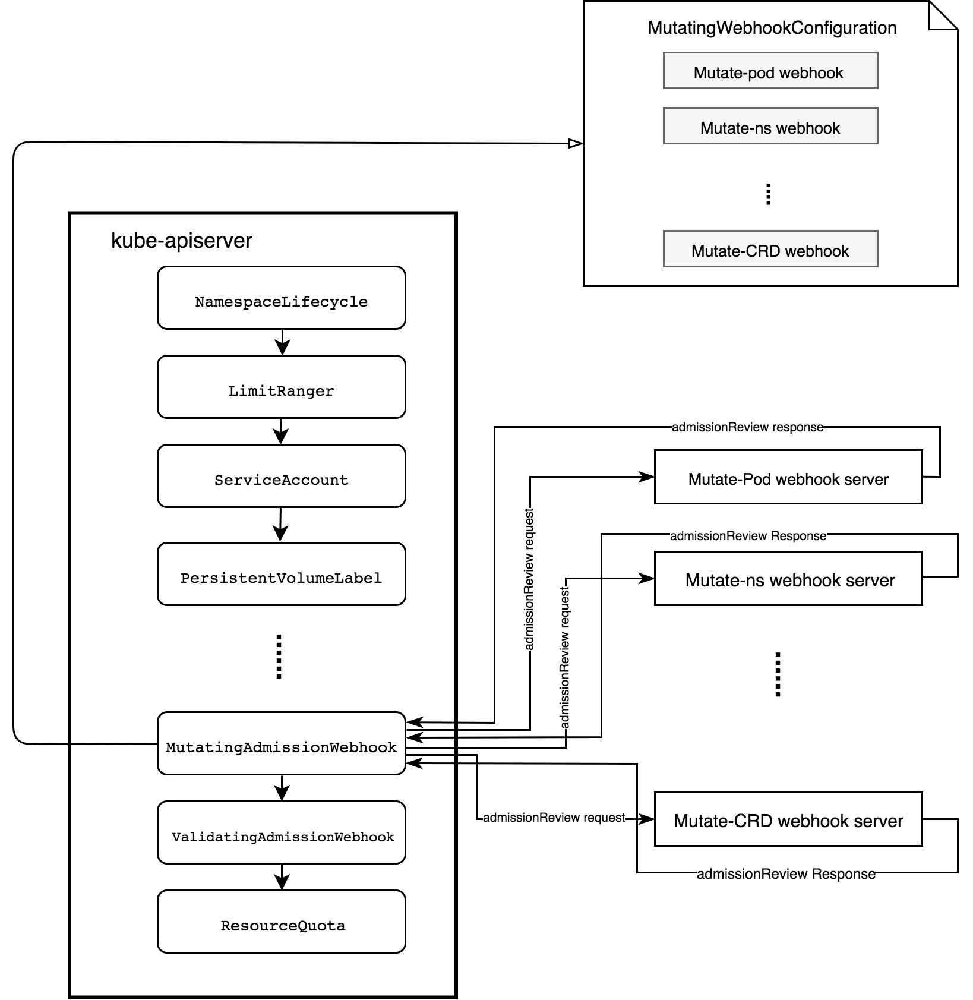

# A dive into Kunernetes MutatingAdmissionWebhook

[Admission controllers](https://kubernetes.io/docs/admin/admission-controllers/) are powerful tools for restricting resources prior to persistence by intercepting requests to `kube-apiserver`. 
But they are not flexible enough for they need to be compiled to binary into `kube-apiserver`. From Kubernetes 1.7, [Initializers](https://v1-8.docs.kubernetes.io/docs/admin/extensible-admission-controllers/#initializers) and [External Admission Webhooks](https://v1-8.docs.kubernetes.io/docs/admin/extensible-admission-controllers/#external-admission-webhooks) are introduced to address this limitation. To Kubernetes 1.9, `Initializers` stays in alpha phase while `External Admission Webhooks` have been promoted to beta and split into [MutatingAdmissionWebhook](https://kubernetes.io/docs/admin/admission-controllers/#mutatingadmissionwebhook-beta-in-19) and [ValidatingAdmissionWebhook](https://kubernetes.io/docs/admin/admission-controllers/#validatingadmissionwebhook-alpha-in-18-beta-in-19).

In this article, we'll dive into the details of `MutatingAdmissionWebhook` and write a working webhook admission server step by step.

`MutatingAdmissionWebhook` together with `ValidatingAdmissionWebhook` are special kind of `admission controllers` which process the mutating and validating on request matching the rules defined in [MutatingWebhookConfiguration](https://kubernetes.io/docs/reference/generated/kubernetes-api/v1.9/#mutatingwebhookconfiguration-v1beta1-admissionregistration)(explained below).

## Why Webhooks first

According to the feedback of alpha of both `GenericAdmissionWebhook` and `Initializers`, k8s community decides to push webhook to beta abd divide it into `MutatingAdmissionWebhook` and `ValidatingAdmissionWebhook`. `MutatingAdmissionWebhook` inherits and extends features of `GenericAdmissionWebhook` to support mutation based on voices from community.

The following explanations for webhooks first are quoted form Mutating Webhooks Beta [design doc](https://docs.google.com/document/d/1c4kdkY3ha9rm0OIRbGleCeaHknZ-NR1nNtDp-i8eH8E/view#):

> 1. **Serves Most Use Cases:** We reviewed code of all current use cases, namely: Kubernetes Built-in Admission Controllers, OpenShift Admission Controllers, Istio & Service Catalog. All of those use cases are well served by mutating and non-mutating webhooks.
> 2. **Less Work:** An engineer quite experienced with both code bases estimated that it is less work to adding Mutating Webhooks and bring both kinds of webhooks to beta; than to bring non-mutating webhooks and initializers to Beta. Some open issues with Initializers with long expected development time include quota replenishment bug, and controller awareness of uninitialized objects.
> 3. **API Consistency:** Prefer completing one related pair of interfaces (both kinds of webhooks) at the same time.

Webhooks' update makes it consistent with other admission controllers and enforces `mutate-before-validate`. Each of narrowly focused webhooks can be added to admission chain without recompiling them and have semantic knowledge of what they are inspecting.

## How MutatingAdmissionWebhook works

`MutatingAdmissionWebhook` intercepts requests matching the rules in `MutatingWebhookConfiguration` before presisted into [ETCD](https://github.com/coreos/etcd). `MutatingAdmissionWebhook` executes the mutating by sending admission requests to webhook server. Webhook server is just plain http server that adhere to [API](https://github.com/kubernetes/kubernetes/blob/v1.9.0/pkg/apis/admission/types.go), so the possible applications are vast.

The following diagram describes how `MutatingAdmissionWebhook` works in details:

The `MutatingAdmissionWebhook` needs three objects to function:

1. MutatingWebhookConfiguration
   `MutatingAdmissionWebhook` need to be registered in the `apiserver` by providing `MutatingWebhookConfiguration`. During the registration process, MutatingAdmissionWebhook states:
   - How to connect to the webhook admission server
   - How to verify the webhook admission server
   - The URL path of the webhook admission server
   - Rules defines what resources and what action it handles
   - How unrecognized errors from the webhook admission server are handled

2. MutatingAdmissionWebhook itself
   `MutatingAdmissionWebhook` is plugin-style admission controller that can be configured into `apiserver`. The `MutatingAdmissionWebhook` plugin get lists of intersted admission webhook from `MutatingWebhookConfiguration`. Then the `MutatingAdmissionWebhook` observes the requests to apiserver and intercepts requests matching the rules in admission webhooks and call them in parallel.

3. Webhook Admission Server
   `Webhook Admission Server` is just plain http server that adhere to k8s [API](https://github.com/kubernetes/kubernetes/blob/v1.9.0/pkg/apis/admission/types.go). 
   For each request to `apiserver`, the `MutatingAdmissionWebhook` sends an `admissionReview` to the relevant webhook admission server. The webhook admission server gathers information like object, oldobject, and userInfo from `admissionReview`, and sends back a `admissionReview` response including a `AdmissionResponse` whose `Allowed` and `Result` fields are filled with the admission decision and optional `Patch` to mutate the resoures.
   